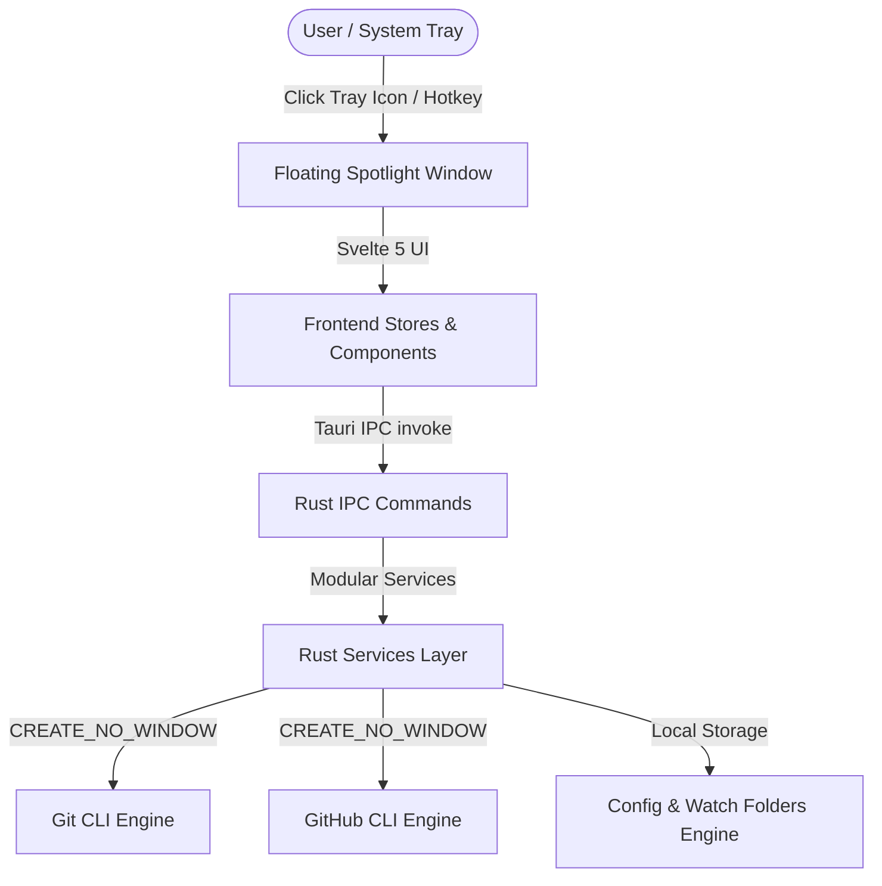

# 🏗️ Technical Architecture & Design

This document details the system architecture, component breakdown, concurrency model, and data contracts for **Worktree & Workspace Companion**.

---

## 1. System Overview

**Worktree & Workspace Companion** is a native Windows system tray utility and Spotlight-style floating dashboard built with **Tauri v2**, **Rust**, **Svelte 5**, and **Tailwind CSS**.

---

## 2. Backend Architecture (`src-tauri/`)

The Rust backend handles low-level OS interactions, system tray lifecycle, and safe subprocess execution.

### Key Subsystems:

1. **System Tray & Window Lifecycle (`tray.rs`)**:
   - Manages the tray icon using `tauri::tray::TrayIconBuilder`.
   - Utilizes `tauri-plugin-positioner` to position the floating dashboard adjacent to the taskbar.
   - Listens to window focus events (`tauri::WindowEvent::Focused(false)`) to automatically hide the window when unfocused (*Spotlight auto-hide*).

2. **Git Engine Service (`services/git.rs`)**:
   - Parses machine-readable output from `git worktree list --porcelain` and `git status --porcelain`.
   - Detects active worktrees, detached HEAD states, locked worktrees, and dirty working trees.
   - Executes commands with Windows creation flag `CREATE_NO_WINDOW = 0x08000000` to eliminate terminal popups.
   - Leverages `rayon` for parallel repository discovery across configured watch folders.

3. **GitHub CLI Service (`services/gh.rs`)**:
   - Queries authenticated GitHub accounts via `gh auth status`.
   - Switches active identities seamlessly via `gh auth switch --hostname github.com -u <user>`.

4. **Orphaned Worktree Cleaner (`services/worktree_cleaner.rs`)**:
   - Compares local worktree branches against remote upstream tracking branches.
   - Identifies branches deleted or merged on the remote.
   - Enforces pre-flight dirty checks (`git status --porcelain`) to guarantee no uncommitted work is deleted.

5. **Configuration Service (`services/config.rs`)**:
   - Manages user preferences, watched root folders, and preferred editor/IDE choices.

---

## 3. Frontend Architecture (`src/`)

The frontend is built with **Svelte 5** leveraging modern runes (`$state`, `$derived`, `$props`) for fine-grained reactivity.

### Directory Structure:
- `src/lib/components/`:
  - `Header.svelte`: Top bar with GitHub active account badge, search bar, and action triggers.
  - `AccountFilterBar.svelte`: Filter worktrees by GitHub profile / organization.
  - `WorktreeList.svelte` & `WorktreeCard.svelte`: Virtualized card list displaying branch details, status badges, lock indicators, and 1-click IDE launcher.
  - `NewWorktreeModal.svelte`: Modal to create a new worktree from existing or new branches.
  - `BranchSwitcherModal.svelte`: Quick switcher to checkout branches.
  - `OrphanCleanerModal.svelte`: Guided cleanup dialog with pre-flight safety summaries.
  - `WatchFoldersModal.svelte`: Configuration dialog for repository root scan paths.
  - `GhAccountModal.svelte`: Account switcher and switcher modal.
- `src/lib/stores/`:
  - `worktrees.ts`: Stores list of discovered worktrees and loading state.
  - `ghAuth.ts`: Active GitHub account and switcher logic.
  - `appConfig.ts`: Application preferences and watch paths.
  - `editors.ts`: Installed editor detection (VS Code, Cursor, Windsurf, Zed, IntelliJ, etc.).

---

## 4. Security & Safety Principles

1. **Subprocess Isolation**: Subprocesses are spawned without shell wrapper invocation (`CREATE_NO_WINDOW`) to protect against injection and prevent visual terminal glitches.
2. **Destructive Guardrails**: Any action executing `git worktree remove` or branch deletion MUST execute a pre-flight dirty check first.
3. **Path Privacy**: Local paths are kept internal and never exposed to unauthenticated endpoints or persistent tracking.
